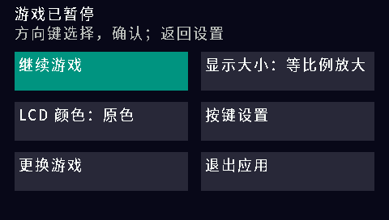
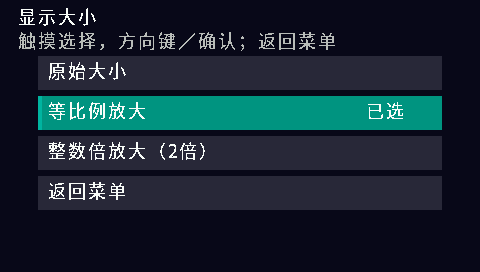
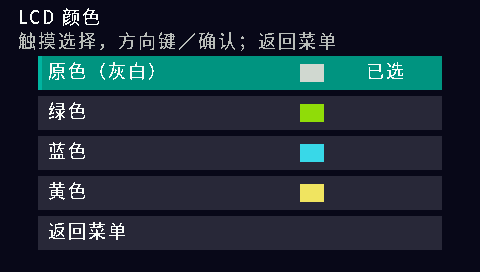
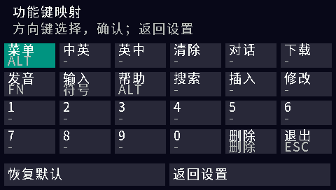
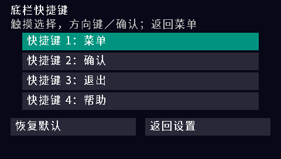
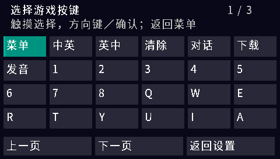

# BBKH1-gam4980

步步高 H1 / Y100 原生 GAM4980 模拟器，使用实体全键盘游玩 `.gam` 游戏。
支持按键映射、四个可配置底栏快捷键、LCD 配色、原始/等比例/整数 2 倍显示、CRC 双槽存档及性能诊断。

## 快速开始

在本仓库右侧 **Releases** 下载 `H1GAM4980-install.zip`，解压后合并到 H1 的 A 盘：

```text
A:\应用\程序\H1GAM4980.bda
A:\gam4980\8.BIN
A:\gam4980\E.BIN
```

自行准备 `.gam` 游戏，启动 GAM4980 图标后通过系统文件选择器打开。
方向键移动，回车确认，返回键或点击游戏画面打开暂停菜单；底栏默认菜单、确认、退出、帮助。
暂停菜单可设置显示大小、LCD 颜色、实体键映射及底栏快捷键。
原机游戏内的「退出」与应用暂停菜单中的「退出应用」用途不同。
两个运行 ROM 均为 2 MiB，来自参考项目，许可范围见 [NOTICE.md](NOTICE.md)。安装包不含商业游戏。

`H1GAM4980-profile-install.zip` 为诊断版，安装到同一程序路径。
游玩后暂停并退出，复制 `A:\gam4980\h1gam.log`；下一次启动会覆盖日志。
完整按键、存档和诊断说明见 [使用说明](gam4980/README.md)。

## 截图

以下为 H1 V1.41 完整固件模拟器中的真实运行截图，测试游戏为本项目的原创 GAM 测试程序。

| 暂停设置 | 显示大小 | LCD 颜色 |
| --- | --- | --- |
|  |  |  |

| 实体键映射 | 底栏快捷键设置 | 快捷键选择 |
| --- | --- | --- |
|  |  |  |

## 依赖与构建

成品运行需要 H1/Y100、两个运行 ROM 和自行准备的游戏。当前不提供声音、即时存档或旧 `.sav` 转换。

开发依赖：Windows、Python 3.12（本地亦验证 Python 3.11）、GNU MIPS GCC 15.2.0、Pillow 12.3.0；MIPS 回归测试另需 Unicorn 2.1.4。
H1 SDK 使用 [HelloClyde/bbk-h1-bda-sdk](https://github.com/HelloClyde/bbk-h1-bda-sdk)，固定提交
`067fe072477861dfc8949d7b1a55279fb92d2548`。字体子集和图标已保存，正常构建无需下载字体。

```powershell
git clone --recurse-submodules https://github.com/HelloClyde/BBKH1-gam4980.git
cd BBKH1-gam4980
python -m pip install -r requirements.txt
python tools/install_toolchain.py
python tools/build_gam4980.py
python tools/build_gam4980.py --profile
python gam4980/tests/distribution.py
python tools/package_release.py
```

可通过 `--toolchain` 或环境变量 `H1_GNU_BIN` 指定现有 MIPS 工具链目录。
安装器按固定 SHA-256 校验工具链压缩包。SDK 尚未提供安装器，因此本仓库提供已验证的 Windows 安装脚本。
GitHub 自动生成的源码 ZIP 不含 SDK 子模块；请使用以上 Git 命令获取完整依赖。
菜单字体再生方法见 [素材说明](gam4980/assets/README.md)。

```powershell
python tools/build_gam4980.py --test-frames 12
python gam4980/tests/mips_smoke.py
python gam4980/tests/profile_analyzer.py
# 主机 C 测试需要 gcc；也可设置 CC 为其完整路径
python gam4980/tests/profile_host.py
```

main/PR 自动构建并运行回归测试，`v*` 标签在验证通过后发布 Release。
正式版和诊断版共享核心，但只有诊断版统计 TCU5 耗时分布。
验证范围及确切 BDA 哈希见 [验证记录](docs/verification.md)；模拟器通过不代表所有真机或游戏均已验证。

## 感谢与许可

感谢 HelloClyde 的 [BBK9588-gam4980](https://github.com/HelloClyde/BBK9588-gam4980)
提供 GAM4980/6502 核心与运行文件，感谢 [BBKH1-GBA](https://github.com/HelloClyde/BBKH1-GBA)
提供文件选择器、中文触摸界面及原生框架参考，感谢 H1 SDK 作者 MrDefinition1999 和贡献者。
感谢 Noto Sans CJK 项目提供中文字体。

应用代码使用 GPL-3.0-or-later，SDK 使用 Apache-2.0，字体使用 OFL-1.1。
第三方内容分别保留其许可；运行 ROM 的独立许可缺项及所有来源见 [NOTICE.md](NOTICE.md)。
